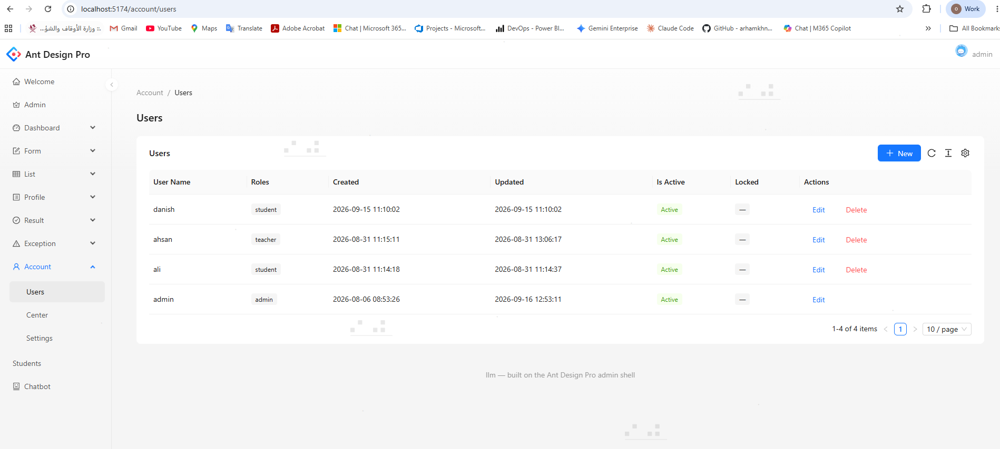
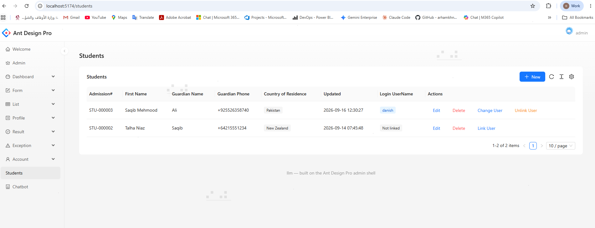
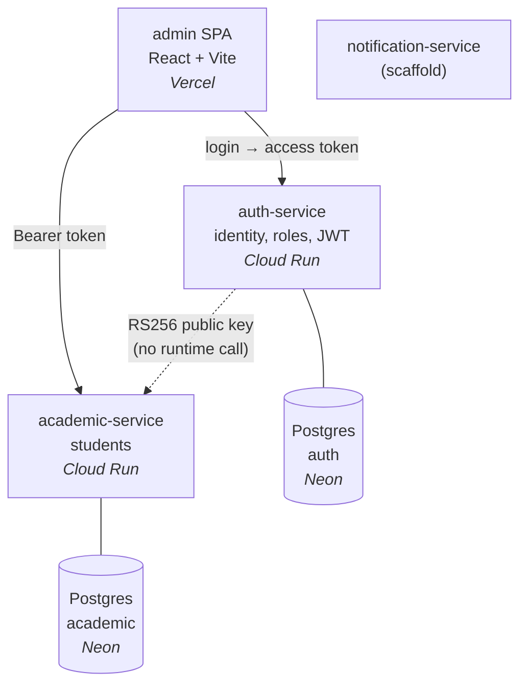

# Ilm (علم — "knowledge")

**Live:** [edustack-auth-service.vercel.app](https://edustack-auth-service.vercel.app) — sign in as `admin` (password on request).
First load is slow: Cloud Run scales to zero and Neon suspends idle computes, so both cold-start.

A multi-role school management platform built as three Node/TypeScript microservices behind a React admin SPA. Roles — admin, teacher, student, parent — drive what each user can see and do.

This is a learning project, and the interesting part is the decisions rather than the CRUD. Each one below is written with its tradeoff, because a choice you can't argue against isn't a choice.

---

## Status

| Component | State |
|---|---|
| `auth-service` | Working — login, refresh rotation, RBAC, user management. 33 unit tests. |
| `academic-service` | Working — student records, linking to login accounts. 4 unit tests. |
| `admin` (React SPA) | Working — user and student management screens. |
| `notification-service` | **Scaffold only** — health endpoint. Event-driven design not yet built. |
| `web` (Next.js) | Reference implementation of the BFF proxy pattern. Not actively developed. |
| Deployment | **Live.** Both services on Cloud Run, SPA on Vercel, databases on Neon. |
| CI/CD | GitHub Actions — typecheck, tests and image builds on every push; deploys to Cloud Run on green. |

---

## Screenshots

**User management** — roles, account status, and brute-force lockout state. The admin's own row has no Delete action; that guard is enforced server-side too.



**Student roster** — phone numbers normalised to E.164, countries stored as ISO codes and rendered as names, and the linked login account shown from a denormalised copy rather than a call to auth-service. Row actions change with link state.



---

## Architecture



The dotted line is the important one: `academic-service` verifies tokens **locally** using the public half of an RS256 keypair. There is no runtime call to `auth-service` on the request path — if `auth-service` is down, `academic-service` keeps authenticating requests normally.

```
ilm/
├── apps/
│   ├── auth-service/        :4001  identity, roles, tokens
│   ├── academic-service/    :4002  student records
│   ├── notification-service/:4003  scaffold
│   ├── admin/               :5174  React admin SPA
│   ├── web/                 :3000  Next.js + BFF proxy (reference)
│   └── ant-design-pro-master/      read-only template reference
└── packages/
    ├── http-kit/            logging, error mapping, request ids, validation
    └── auth-kit/            JWT verification, authenticate / requireRole
```

---

## The decisions

### Why three services, and why not five

Originally planned as five. `student-service`, `attendance-service`, and `grade-service` were merged into `academic-service` because they share the same relational data and would have spent their lives calling each other — distributed joins and cross-service transactions for no isolation benefit.

The three that remain each differ on an axis that justifies a boundary:

- **`auth-service` is a trust boundary.** It holds password hashes and the token signing key. A vulnerability in the grades UI shouldn't put the credential store in blast radius. Its load profile is also different — bursty at login, quiet after.
- **`academic-service` is the transactional domain.** Relational, request/response, needs ACID within itself.
- **`notification-service` is event-driven.** A different communication pattern entirely, and it can be down without breaking anything critical.

**Tradeoff:** network calls where function calls would do, three deploy pipelines, and harder debugging — which is why request ids propagate across services (see Observability).

**Honest note:** at this scale a modular monolith would be the correct production choice. The split is deliberate, to build real service boundaries rather than read about them.

### Database per service

Each service owns its own Postgres database. No shared tables, no cross-service queries.

If two services read the same tables you don't have microservices — you have a distributed monolith with added latency, where one migration forces a coordinated deploy of everything that touches it.

**What it costs, concretely in this codebase:**

- `Student.userId` references a `User` in `auth-service` with **no foreign key** and no referential integrity. A typo'd id would be stored happily.
- "Which student accounts are unlinked?" spans both databases, so it can't be one query. The admin SPA fetches from each service and composes client-side. In a monolith this is one `WHERE NOT EXISTS`.
- No ACID across services. Creating a login *and* linking it is two writes in two databases (see Distributed transactions).

### RS256 over HS256

**HS256 is symmetric** — one shared secret for signing and verifying. Give `academic-service` the ability to verify tokens and you've given it the ability to mint an admin token for anyone. A vulnerability in the least sensitive service becomes a full authentication compromise.

**RS256 is asymmetric.** `auth-service` holds the private key and is the only thing that can sign. Everything else gets the public key, which verifies but cannot sign — and isn't a secret, so it can live in an env var or be published at a URL.

`packages/auth-kit` deliberately contains **only** verification. There is no code path in it that can produce a token.

Verification also pins the algorithm:

```ts
jwt.verify(token, publicKey, { algorithms: ["RS256"], issuer: TOKEN_ISSUER })
```

Without `algorithms`, a forged token could declare `"alg": "none"`, or be HMAC-signed using the public key as the shared secret — the classic algorithm-confusion attack.

**Tradeoff:** slower than HMAC, and there are keys to manage. For a single monolith, HS256 would be fine. The moment there's a second verifier, it isn't.

### RBAC without per-user permissions

Roles hold permissions; users hold roles. There is **no** direct user→permission assignment, matching the NIST core RBAC model.

The deciding argument is auditability. Ask *"who can delete grades?"*:

- Role-only: find the roles holding `grade:delete`, then who holds those roles. One query.
- With per-user overrides: scan every user, because any of them might have an ad-hoc grant. There's no longer a single place that describes access.

Kubernetes RBAC, GitHub, and Slack all work this way. AWS IAM is policy-based because it's a *platform* serving arbitrary organisations — and IAM policy evaluation is famously hard to reason about. That's the complexity being avoided.

**Tradeoff:** less flexible. The answer to "this user needs slightly different access" is a new role, or making roles themselves editable — not a per-user exception.

`RolePermission` is an **explicit** join model rather than Prisma's implicit many-to-many. That costs an extra hop in every query (`role.permissions[].permission.name`) and buys the ability to put columns on the relationship itself — `grantedAt`, `grantedBy`, `expiresAt`. Audit metadata on permission grants is a normal requirement; implicit m2m locks you out of it.

### Refresh token rotation with reuse detection

Access tokens live 15 minutes. Refresh tokens are single-use and rotate on every refresh.

If a refresh token is presented twice, two parties hold it — the legitimate user and a thief — and there's no way to tell which is which. So the entire token family for that user is revoked and everyone re-authenticates.

Tokens are stored as SHA-256 hashes, so a database dump doesn't yield usable credentials.

Refresh tokens are also revoked when a user's roles change or their account is disabled — otherwise a demoted admin keeps elevated access, baked into their JWT, until it expires.

### Argon2 over bcrypt

Argon2 won the 2015 Password Hashing Competition and is OWASP's current recommendation. Unlike bcrypt it's **memory-hard**, which defeats GPU and ASIC cracking rigs — bcrypt is CPU-hard only, and modern hardware parallelises it cheaply.

### Write-time denormalisation

`Student` stores `createdByUsername` and `loginUsername` — display copies of data owned by `auth-service`.

The alternative is calling `auth-service` on every roster read to resolve ids into names, which couples the read path to another service's availability. Copying the value at write time removes that dependency entirely.

**Tradeoff:** the copy goes stale if a username changes. For an audit field that's arguably correct — it records who acted under the name they had at the time. If freshness mattered, a `user.updated` event would keep it current.

### Soft delete

Users and students are flagged `isDeleted` rather than removed — grades must remain attributable to a teacher who has left, and transcripts must survive an account being deleted.

**Tradeoff:** every query must remember to filter. `findUserByUsername` uses `findFirst({ username, isDeleted: false })` precisely because a soft-deleted user could otherwise still log in. The unique `username` also stays occupied, so the name can't be reused.

### Shared packages: transport only, never domain

`packages/http-kit` and `packages/auth-kit` contain logging, error mapping, request ids, validation, and JWT verification — and **zero domain concepts**. No `User`, no `Student`, no `Gender`.

Sharing a domain model across services recreates exactly the coupling microservices exist to remove: change it and every service needs redeploying in lockstep. Sharing transport plumbing has no such effect.

They were extracted when a second service genuinely needed them, not up front — a shared library designed before you have two real consumers is shaped by guesswork.

**Tradeoff:** the monorepo moves together. A breaking change to `http-kit` hits all services at once and can't be rolled out gradually. That's correct inside one repo with one owner; separately owned services would want versioned, published packages instead.

### Observability

Structured JSON logs via pino, to stdout only — never files, so any platform's log driver can collect them.

Every request carries an `x-request-id`: reused if the caller supplied one, generated otherwise, echoed on the response, and attached to every log line for that request. The same id appears in error responses, so a user-reported failure maps to an exact log line.

Redaction is declared once in the logger config — `authorization`, `cookie`, `set-cookie`, and any `password`, `passwordHash`, `accessToken`, or `refreshToken` field — so no call site can accidentally log a credential.

### Phone numbers stored as E.164

Guardian phone numbers are normalised to `+97455551234` before validation, so `+974 5555 1234`, `05555 1234`, and the canonical form all become the same stored value. `phoneCountry` is **derived server-side** from the normalised number rather than accepted from the client, so the two can't disagree.

Countries are stored as ISO 3166-1 alpha-2 codes (`QA`), never display names — names change (Turkey → Türkiye), vary by language, and have no canonical form. `Intl.DisplayNames` renders them at display time, localising for free.

---

### Deploying without stored credentials

GitHub Actions authenticates to Google Cloud with **Workload Identity Federation**, not a service-account key.

Each run, GitHub mints a short-lived OIDC token describing the workflow. GCP validates it against `token.actions.githubusercontent.com`, checks an attribute condition — `assertion.repository == 'malikumar1695/edustack'` — and only then allows impersonation of the deploy service account, issuing a credential valid for about an hour.

The alternative is a service-account JSON key in GitHub secrets: a long-lived credential that stays valid until someone notices it leaked. Here there is no key to leak, rotate, or revoke. The four GitHub values this needs live in *Variables*, not *Secrets*, because none of them are sensitive — the provider path is useless without an OIDC token from this specific repository.

**The attribute condition is the security boundary.** Without it, any repository on GitHub could complete the same exchange.

### Two identities, deliberately separated

- **`github-deployer`** — what CI acts as. Can push images and deploy Cloud Run services. **Cannot read secrets.**
- **The runtime service account** — what containers run as. Can read its own secrets. **Cannot deploy.**

So a compromised GitHub account could ship bad code, but could not exfiltrate the JWT signing key or the database credentials. Splitting the two costs nothing and bounds the blast radius of the likelier compromise.

### Secrets in Secret Manager, not environment variables

Connection strings and both halves of the RS256 keypair live in Secret Manager and are mounted at container start.

Plain env vars are visible to anyone with Cloud Run viewer access. Secret Manager adds encryption at rest, versioning (rotate a key by adding a version, no redeploy), separate IAM, and an audit trail of every access.

Mounting from files also preserves real newlines, so the PEMs need none of the escaped-newline handling that inline env vars force.

**Tradeoff:** `:latest` resolves when an instance *starts*, so a rotated secret only reaches running containers on the next revision.

### Serverless tradeoffs made visible

`--min-instances=0` keeps the project inside the free tier and means the service costs nothing while idle — at the price of a cold start. Neon suspends idle computes for the same reason.

Together they produce a real failure this code had to handle: the first request after a quiet period waits on **both** waking up, which exceeded Prisma's 2-second default `maxWait` and returned a 500. Both paginated queries now pass explicit `maxWait`/`timeout` values sized for serverless rather than for a local database.

`--max-instances=2` caps the blast radius of a bot finding the URL — without it, scaling is unbounded and so is the bill.

## Distributed transactions

Creating a login for a student means two writes in two databases:

```
POST /users              → auth-service creates the account
PUT  /students/:id/user  → academic-service records the link
```

There is no transaction spanning both. If the second fails, an orphan account exists.

**The chosen approach:** the admin SPA orchestrates both calls, and a failure surfaces to the operator, who retries the link — the account already exists, so it's one click. Deliberate: this is a rare, admin-initiated action with a human watching, and the human is a better retry mechanism than exponential backoff because they can decide whether it still matters.

**What a stricter system would do:** a transactional outbox — write the job in the same local transaction as the state change, drain it with a worker that retries with backoff, make the downstream call idempotent, and dead-letter what can't succeed. That's the right answer when nobody is waiting; it's overkill for an action an operator can resolve immediately.

Neither service writes to the other's database in any variant. The trigger may move; the ownership doesn't.

---

## Known gaps

Deliberate, not oversights:

- **The access token is kept in `localStorage`**, which is readable by any injected script — an XSS becomes account takeover. The stronger pattern is holding it in memory and re-acquiring it via the refresh cookie on page load. The refresh token *is* already `httpOnly`, `sameSite=strict`, and scoped to `/auth`.
- **No API gateway.** The SPA calls each service directly. Real deployments put a gateway in front for routing, rate limiting, and auth termination.
- **No service discovery** — service URLs are configuration.
- **No resilience patterns.** No circuit breakers or retries, because there are currently no synchronous service-to-service calls to protect. They'd be added alongside the first one.
- **`notification-service` is a scaffold.** Until it exists, every interaction is synchronous request/response — the weakest form of decoupling.
- **Integration tests are unreliable** against the hosted database and are excluded from the default run.
- **Cold starts are user-visible.** `min-instances=0` keeps hosting free, so the first request after an idle period takes several seconds. Setting it to 1 removes the delay and leaves the free tier.
- **Migrations are applied by hand**, not by the pipeline. Deliberate: concurrent deploys racing on schema changes is a worse failure than a manual step.

---

## Running locally

Requires Node 20+ and two Postgres databases (Neon free tier works).

```bash
npm install                 # from the repo root — npm workspaces
npm run build:packages      # http-kit and auth-kit compile to dist/
```

Each service needs a `.env` (see `.env.example` in each). `academic-service` needs `JWT_PUBLIC_KEY` — the public half of `auth-service`'s keypair, as an inline PEM with escaped newlines.

```bash
# auth-service
cd apps/auth-service
npx prisma migrate deploy && npx prisma db seed   # roles, permissions, an admin user
npm run dev                                       # :4001

# academic-service
cd apps/academic-service
npx prisma migrate deploy
npm run dev                                       # :4002

# admin SPA
cd apps/admin && npm run dev                      # :5174
```

Tests:
```bash
npx vitest run src/    # from either service — unit tests only
```

---

## API

**auth-service** — `/auth` is public, everything else requires an admin token.

| | |
|---|---|
| `POST /auth/login` | issue access token + refresh cookie |
| `POST /auth/refresh` | rotate refresh token, issue new access token |
| `POST /auth/logout` | revoke the refresh token |
| `GET /users?role=&current=&pageSize=` | paginated, optionally filtered by role |
| `POST /users` · `PUT /users/:id` · `DELETE /users/:id` | create, update roles/status, soft delete |
| `POST /users/:id/unlock` | clear a brute-force lockout |
| `GET /roles` | roles for pickers |

**academic-service** — all routes require a valid token.

| | |
|---|---|
| `GET /students?current=&pageSize=` | paginated roster (admin, teacher) |
| `POST /students` · `PUT /students/:id` · `DELETE /students/:id` | manage records |
| `PUT /students/:id/user` · `DELETE /students/:id/user` | link / unlink a login account (admin) |
| `GET /students/linked-user-ids` | ids already linked, for client-side composition |

Errors are uniform across both services:

```json
{ "error": { "code": "USERNAME_TAKEN", "message": "Username is already taken", "requestId": "b6073fd3-…" } }
```

---

## Next

1. Event-driven `notification-service` — a transactional outbox so a committed grade can't lose its notification
2. JWKS endpoint, so signing keys rotate without redeploying every consumer
3. Integration tests against a Postgres service container in CI, replacing the hosted database they currently flake on
4. OpenAPI specs, with the admin client generated from them
